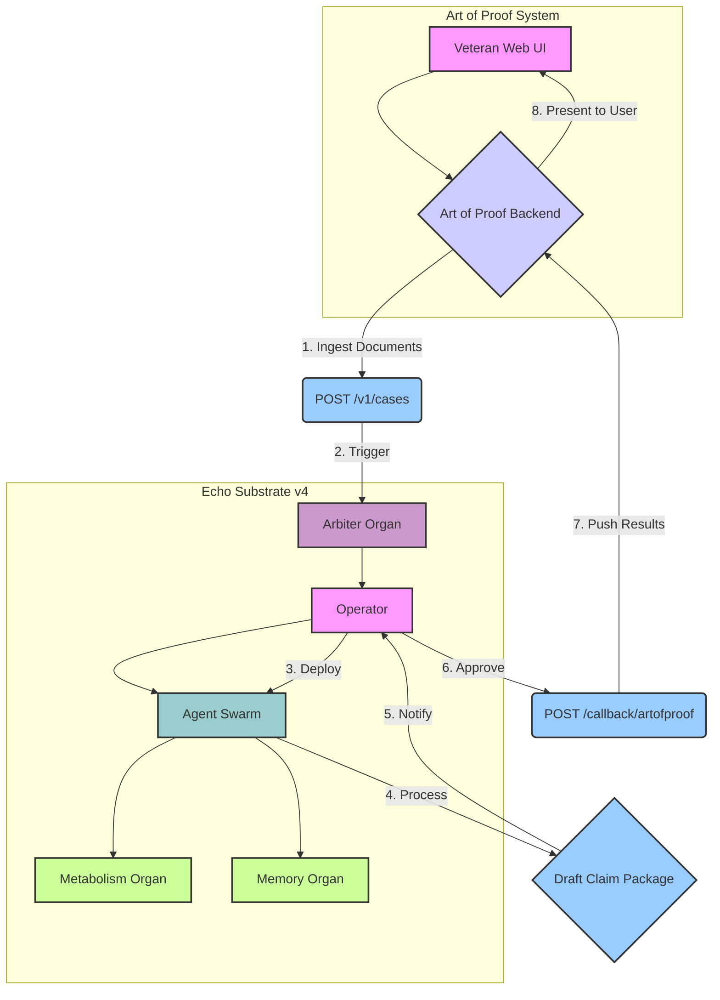

# Art of Proof Integration Plan

**Version:** 1.0  
**Date:** December 12, 2025  
**Author:** Manus AI

---

## 1. Executive Summary

This document details the plan to integrate the **Art of Proof** system with **Echo Substrate v4**. The goal is to leverage the Substrate's advanced capabilities—such as its 8-organ architecture, auditable memory, and constrained agent framework—to automate and enhance the process of compiling and submitting VA disability claims.

This integration will serve as the **first real-world validation** of Echo Substrate v4, proving its ability to handle sensitive data, execute complex workflows, and provide a secure, auditable, and intelligent service to a real customer.

---

## 2. Integration Architecture & Data Flow

The integration will follow a services-oriented architecture where Art of Proof acts as the client-facing application and Echo Substrate v4 acts as the backend processing engine. The two systems will communicate via a secure, authenticated REST API.

### High-Level Data Flow

1.  **Data Ingestion (Art of Proof → Substrate):** A veteran uploads their medical records, service records, and personal statements to the Art of Proof web application. Art of Proof then securely transmits these documents to a dedicated endpoint on the Echo Substrate.

2.  **Tasking & Processing (Inside Substrate):**
    *   The Substrate's **Arbiter** receives the new case and transitions the system to **Mode 1: Alert**.
    *   The human **Operator** is notified and authorizes a transition to **Mode 2: Act**, deploying a specialized "VA Claim Agent" swarm.
    *   **Sensor Agents** read and parse the uploaded documents, extracting key entities (diagnoses, dates of service, medical opinions, etc.).
    *   **Task Agents** correlate the extracted entities, identify missing evidence, and assemble a draft claim package (e.g., a completed VA Form 21-526EZ).
    *   All actions are charged against a budget managed by the **Metabolism** organ and logged immutably by the **Memory** organ.

3.  **Review & Output (Substrate → Art of Proof):**
    *   Once the draft is complete, the Substrate transitions back to **Mode 1: Alert** and notifies the human **Operator**.
    *   The Operator reviews the draft claim package within the Substrate's (future) UI or via a secure link.
    *   Upon approval, the Substrate pushes the completed claim package and a summary report back to the Art of Proof system.

4.  **Presentation (Art of Proof):** The Art of Proof application presents the completed, submission-ready claim package to the veteran for final review and submission.

### Architectural Diagram




---

## 3. API Endpoints & Data Schemas

The following endpoints will be implemented in Echo Substrate v4 to support the Art of Proof integration.

### 3.1. Ingest Case Documents

**Endpoint:** `POST /v1/cases`  
**Purpose:** Receive a new VA disability claim case from Art of Proof, including all supporting documents.  
**Authentication:** JWT (requires `operator` or `intent_architect` role)

**Request Schema:**

```json
{
  "case_id": "string (UUID)",
  "veteran": {
    "first_name": "string",
    "last_name": "string",
    "ssn_last_4": "string (4 digits)",
    "date_of_birth": "string (ISO 8601)",
    "email": "string (email)",
    "phone": "string (optional)"
  },
  "documents": [
    {
      "document_id": "string (UUID)",
      "document_type": "string (enum: medical_record, service_record, personal_statement, other)",
      "file_name": "string",
      "file_url": "string (presigned S3 URL or base64-encoded content)",
      "upload_date": "string (ISO 8601)"
    }
  ],
  "claim_type": "string (enum: initial, increase, appeal)",
  "callback_url": "string (URL for Art of Proof to receive results)",
  "metadata": {
    "source": "string (e.g., 'artofproof_web')",
    "priority": "string (enum: low, medium, high)"
  }
}
```

**Response Schema:**

```json
{
  "status": "string (enum: accepted, rejected)",
  "substrate_case_id": "string (UUID, internal Substrate tracking ID)",
  "message": "string",
  "estimated_completion_time": "string (ISO 8601, optional)"
}
```

**Error Codes:**
- `400 Bad Request` - Invalid document format or missing required fields
- `401 Unauthorized` - Invalid or missing JWT
- `403 Forbidden` - Insufficient role permissions
- `413 Payload Too Large` - Document size exceeds limit
- `500 Internal Server Error` - Substrate processing error

---

### 3.2. Query Case Status

**Endpoint:** `GET /v1/cases/{substrate_case_id}`  
**Purpose:** Check the current status of a case being processed by the Substrate.  
**Authentication:** JWT (requires `operator`, `arbiter`, or `auditor` role)

**Response Schema:**

```json
{
  "substrate_case_id": "string (UUID)",
  "original_case_id": "string (UUID, from Art of Proof)",
  "status": "string (enum: queued, processing, review_pending, completed, failed)",
  "current_mode": "string (enum: observe, alert, act, defend)",
  "progress": {
    "documents_parsed": "integer",
    "total_documents": "integer",
    "entities_extracted": "integer",
    "draft_completion_percent": "integer (0-100)"
  },
  "metabolic_cost": {
    "budget_allocated": "number (USD)",
    "cost_consumed": "number (USD)",
    "remaining_budget": "number (USD)"
  },
  "created_at": "string (ISO 8601)",
  "updated_at": "string (ISO 8601)",
  "estimated_completion_time": "string (ISO 8601, optional)"
}
```

---

### 3.3. Retrieve Completed Claim Package

**Endpoint:** `GET /v1/cases/{substrate_case_id}/package`  
**Purpose:** Retrieve the completed claim package once processing is finished.  
**Authentication:** JWT (requires `operator` or `intent_architect` role)

**Response Schema:**

```json
{
  "substrate_case_id": "string (UUID)",
  "status": "string (enum: completed, failed)",
  "claim_package": {
    "form_21_526ez": {
      "file_url": "string (presigned S3 URL to completed PDF)",
      "completion_date": "string (ISO 8601)"
    },
    "supporting_documents": [
      {
        "document_type": "string",
        "file_url": "string (presigned S3 URL)",
        "description": "string"
      }
    ],
    "summary_report": {
      "file_url": "string (presigned S3 URL to PDF report)",
      "key_findings": [
        {
          "finding": "string (e.g., 'Service-connected PTSD diagnosis confirmed')",
          "confidence": "string (enum: high, medium, low)",
          "supporting_evidence": "string (reference to document)"
        }
      ],
      "missing_evidence": [
        {
          "item": "string (e.g., 'Nexus letter from treating physician')",
          "recommendation": "string"
        }
      ]
    }
  },
  "audit_trail": {
    "total_actions": "integer",
    "audit_log_url": "string (presigned S3 URL to immutable event log)"
  },
  "metabolic_summary": {
    "total_cost": "number (USD)",
    "breakdown": [
      {
        "action_type": "string (e.g., 'document_parsing')",
        "count": "integer",
        "cost": "number (USD)"
      }
    ]
  }
}
```

---

### 3.4. Callback to Art of Proof (Substrate → Art of Proof)

**Endpoint:** `POST {callback_url}` (provided by Art of Proof in the initial case submission)  
**Purpose:** Notify Art of Proof when a case has completed processing.  
**Authentication:** API key or shared secret (configured during Art of Proof setup)

**Request Schema (sent by Substrate):**

```json
{
  "substrate_case_id": "string (UUID)",
  "original_case_id": "string (UUID, from Art of Proof)",
  "status": "string (enum: completed, failed)",
  "message": "string",
  "package_url": "string (URL to retrieve the completed package via GET /v1/cases/{id}/package)",
  "completed_at": "string (ISO 8601)"
}
```

**Expected Response from Art of Proof:**

```json
{
  "status": "acknowledged"
}
```

---

### 3.5. Administrative Endpoints

**Endpoint:** `POST /v1/cases/{substrate_case_id}/cancel`  
**Purpose:** Cancel a case that is currently being processed.  
**Authentication:** JWT (requires `arbiter` or `intent_architect` role)

**Response Schema:**

```json
{
  "status": "string (enum: cancelled, cannot_cancel)",
  "message": "string"
}
```

---

**Endpoint:** `GET /v1/cases/{substrate_case_id}/audit`  
**Purpose:** Retrieve the full, immutable audit trail for a case.  
**Authentication:** JWT (requires `auditor` role)

**Response Schema:**

```json
{
  "substrate_case_id": "string (UUID)",
  "audit_events": [
    {
      "event_id": "string (UUID)",
      "timestamp": "string (ISO 8601)",
      "event_type": "string (e.g., 'document_parsed', 'entity_extracted', 'state_transition')",
      "actor": "string (agent ID or human username)",
      "action": "string",
      "metadata": "object (event-specific data)"
    }
  ]
}
```


---

## 4. Implementation Plan & Code Structure

The integration will be implemented in phases over a 60-day timeline, with each phase building on the previous one.

### Phase 1: API Endpoints & Data Models (Days 1-14)

**Objective:** Implement the core API endpoints and database models to support case ingestion and tracking.

**Tasks:**

1.  **Database Schema Extension:**
    *   Create new tables: `cases`, `case_documents`, `case_events`, `claim_packages`
    *   Add foreign key relationships to existing `memory_events` table

2.  **API Implementation:**
    *   Implement `POST /v1/cases` endpoint
    *   Implement `GET /v1/cases/{id}` endpoint
    *   Implement `GET /v1/cases/{id}/package` endpoint
    *   Implement `POST /v1/cases/{id}/cancel` endpoint
    *   Implement `GET /v1/cases/{id}/audit` endpoint

3.  **Authentication & Authorization:**
    *   Extend existing JWT middleware to support new endpoints
    *   Add role-based access control checks

**Deliverables:**
- Updated database schema (migration scripts)
- 5 new API endpoints (fully tested)
- Updated API documentation (Swagger/ReDoc)

---

### Phase 2: Document Processing Agents (Days 15-35)

**Objective:** Build the specialized agents that will parse documents, extract entities, and assemble claim packages.

**Agent Architecture:**

```
/src/agents/artofproof/
├── __init__.py
├── document_parser.py       # Sensor Agent: Parse PDFs, extract text
├── entity_extractor.py      # Task Agent: NER for diagnoses, dates, etc.
├── claim_assembler.py       # Task Agent: Fill out VA Form 21-526EZ
├── evidence_validator.py    # Task Agent: Check for missing evidence
└── package_generator.py     # Task Agent: Generate final PDF package
```

**Tasks:**

1.  **Document Parser Agent (Sensor):**
    *   Use `pdfplumber` or `PyMuPDF` to extract text from uploaded PDFs
    *   Handle OCR for scanned documents (using `pytesseract` or cloud OCR API)
    *   Store extracted text in the Memory organ

2.  **Entity Extractor Agent (Task):**
    *   Use a lightweight NER model (e.g., spaCy's `en_core_web_sm` or a fine-tuned medical NER model)
    *   Extract: diagnoses, dates of service, medical opinions, treatment history
    *   Store extracted entities in a structured format

3.  **Claim Assembler Agent (Task):**
    *   Map extracted entities to VA Form 21-526EZ fields
    *   Use a PDF form-filling library (e.g., `pdfrw` or `PyPDF2`) to populate the form
    *   Generate a draft PDF

4.  **Evidence Validator Agent (Task):**
    *   Check for required evidence based on claim type
    *   Flag missing items (e.g., "Nexus letter required for service connection")
    *   Generate a summary report

5.  **Package Generator Agent (Task):**
    *   Compile the completed form, supporting documents, and summary report
    *   Upload to S3 (or similar) and generate presigned URLs
    *   Update the `claim_packages` table

**Deliverables:**
- 5 specialized agents (fully tested)
- Integration with Metabolism (budget tracking for each agent action)
- Integration with Memory (audit logging for each agent action)

---

### Phase 3: Workflow Orchestration & Human-in-the-Loop (Days 36-50)

**Objective:** Implement the Arbiter-driven workflow that coordinates the agents and integrates human oversight.

**Tasks:**

1.  **Workflow State Machine:**
    *   Define a new workflow: `va_claim_processing`
    *   States: `queued`, `parsing`, `extracting`, `assembling`, `review_pending`, `completed`, `failed`
    *   Transitions managed by the Arbiter organ

2.  **Human-in-the-Loop Integration:**
    *   When a draft claim package is ready, the Arbiter transitions to `review_pending`
    *   Notify the human Operator (via email, Slack, or in-app notification)
    *   Operator reviews the draft and either approves or requests revisions
    *   On approval, the Arbiter transitions to `completed` and triggers the callback to Art of Proof

3.  **Callback Implementation:**
    *   Implement the callback function that POSTs to Art of Proof's `callback_url`
    *   Handle retries and error logging

**Deliverables:**
- Workflow state machine (integrated with Arbiter)
- Human review interface (basic CLI or web UI)
- Callback mechanism (with retry logic)

---

### Phase 4: Testing, Hardening, & Documentation (Days 51-60)

**Objective:** Ensure the integration is production-ready with comprehensive testing and documentation.

**Tasks:**

1.  **End-to-End Testing:**
    *   Create test cases with real (anonymized) VA claim documents
    *   Run the full workflow from ingestion to package generation
    *   Validate that all audit logs are complete and immutable

2.  **Security Hardening:**
    *   Ensure all document uploads are scanned for malware
    *   Validate that presigned URLs have appropriate expiration times
    *   Audit all database queries for SQL injection vulnerabilities

3.  **Performance Testing:**
    *   Test with 10 concurrent cases to ensure the system can handle load
    *   Optimize database queries and agent execution times

4.  **Documentation:**
    *   Update the main README with Art of Proof integration instructions
    *   Create a separate integration guide for Art of Proof developers
    *   Document all API endpoints in the Swagger UI

**Deliverables:**
- 20+ end-to-end tests (passing)
- Security audit report
- Performance benchmark report
- Complete integration documentation

---

### Code Structure Overview

```
/home/ubuntu/echo-substrate-v4/
├── src/
│   ├── api/
│   │   ├── main.py                  # Existing FastAPI app
│   │   ├── routes/
│   │   │   ├── cases.py             # NEW: Art of Proof case endpoints
│   │   │   └── ...
│   ├── organs/
│   │   ├── models.py                # UPDATED: Add case-related models
│   │   ├── arbiter.py               # UPDATED: Add va_claim_processing workflow
│   │   └── ...
│   ├── agents/
│   │   ├── artofproof/              # NEW: Art of Proof-specific agents
│   │   │   ├── __init__.py
│   │   │   ├── document_parser.py
│   │   │   ├── entity_extractor.py
│   │   │   ├── claim_assembler.py
│   │   │   ├── evidence_validator.py
│   │   │   └── package_generator.py
│   │   └── ...
│   ├── utils/
│   │   ├── watermark.py             # Existing
│   │   ├── pdf_utils.py             # NEW: PDF parsing and form-filling utilities
│   │   └── ...
│   └── interpretation/              # Existing
├── tests/
│   ├── test_organs.py               # Existing
│   ├── test_artofproof_integration.py  # NEW: End-to-end integration tests
│   └── ...
├── docs/
│   ├── ART_OF_PROOF_INTEGRATION_PLAN.md  # This document
│   └── ...
└── ...
```


---

## 5. Deployment & Testing Strategy

### 5.1. Deployment Environment

- **Staging Environment:** A dedicated staging environment will be created that mirrors production. It will have its own database and S3 buckets. All new features will be deployed to staging first for testing.
- **Production Environment:** The production environment will be updated via a blue-green deployment strategy to minimize downtime. The Art of Proof integration will initially be deployed as a feature-flagged service, available only to a select group of pilot users.

### 5.2. Testing Strategy

- **Unit Tests:** Each new agent and utility function will have comprehensive unit tests.
- **Integration Tests:** The interaction between agents and the core Substrate organs (Metabolism, Memory, Arbiter) will be tested.
- **End-to-End Tests:** A suite of tests will simulate the full workflow, from a `POST /v1/cases` request to the final callback to Art of Proof. These tests will use a library of anonymized sample documents.
- **Security Testing:** A third-party security firm will be engaged to conduct a penetration test of the new API endpoints before the public launch.
- **User Acceptance Testing (UAT):** The Art of Proof team and a small group of pilot users (veterans) will test the full workflow to ensure it meets their needs and is easy to use.

### 5.3. Go-Live Checklist

- [ ] All unit and integration tests passing
- [ ] End-to-end tests passing with 95%+ success rate
- [ ] Security audit complete with no critical vulnerabilities outstanding
- [ ] Performance benchmarks met (e.g., average case processing time < 30 minutes)
- [ ] UAT complete and signed off by Art of Proof team
- [ ] Monitoring and alerting configured for all new services
- [ ] Documentation complete and published

---

## 6. Success Metrics & KPIs

- **Case Processing Time:** Average time from case ingestion to package completion.
- **Accuracy Rate:** Percentage of claims that are correctly assembled without requiring manual correction.
- **Metabolic Cost per Case:** Average cost (in USD) to process a single case.
- **Customer Satisfaction (CSAT):** Feedback from pilot users on the quality and usefulness of the generated claim packages.
- **System Uptime:** 99.9% uptime for all API endpoints.

---

## 7. Conclusion

This integration plan provides a comprehensive roadmap for leveraging Echo Substrate v4 to power the Art of Proof system. By following this plan, we will not only deliver a powerful new service to veterans but also achieve the first real-world validation of the Echo Substrate, paving the way for its future commercial success.
