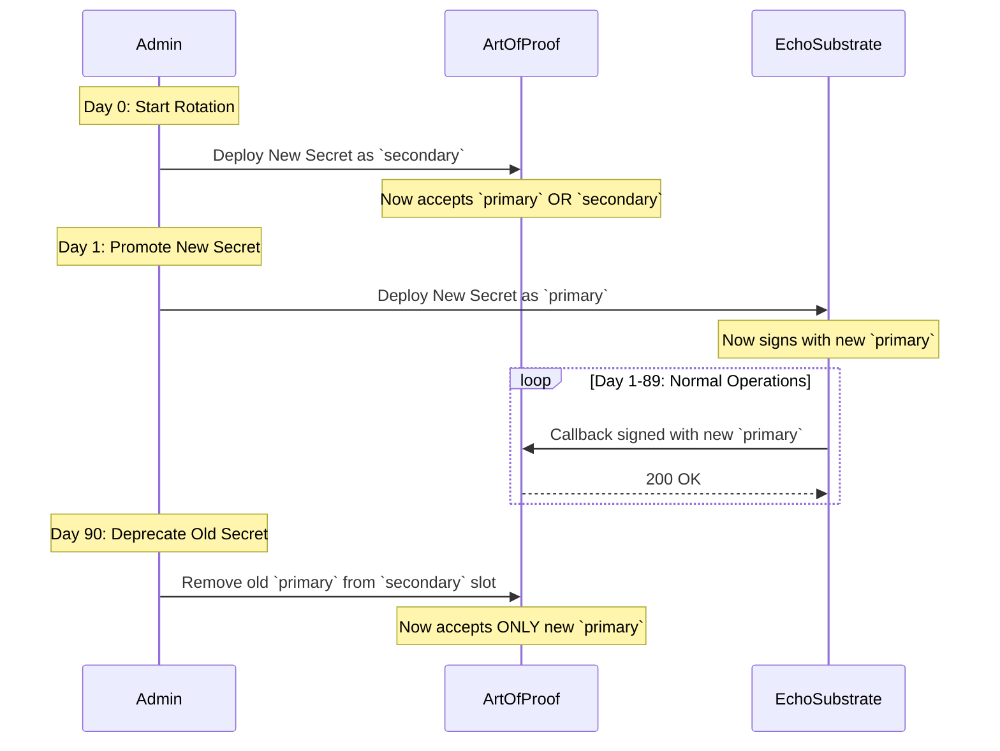

# Callback Secret: Security Analysis & Rotation Strategy

**Version:** 1.0  
**Date:** December 12, 2025  
**Author:** Manus AI

---

## 1. Security Implications of the `callback_secret`

The `callback_secret` is a **shared secret** used to authenticate webhook callbacks from Echo Substrate v4 to the Art of Proof system. Its primary purpose is to ensure that Art of Proof only accepts status updates from a legitimate Substrate instance.

### 1.1. Threat Model

| Threat Actor | Attack Vector | Impact of Compromise |
|---|---|---|
| **External Attacker** | Intercepts the `callback_secret` via a man-in-the-middle (MITM) attack or by compromising the Art of Proof environment. | **High.** The attacker can send fake status updates to Art of Proof, potentially tricking veterans into believing their claim is complete when it is not, or injecting malicious links into the `package_url`. |
| **Malicious Insider (Art of Proof)** | An employee with access to the Art of Proof codebase or environment variables leaks the secret. | **High.** Same impact as an external attacker. |
| **Malicious Insider (Echo Substrate)** | An employee with access to the Substrate codebase or environment variables leaks the secret. | **Low.** The Substrate only *sends* callbacks; it does not accept them. A compromised Substrate instance could send fake callbacks, but this is a broader system integrity issue, not a `callback_secret` issue. |

### 1.2. Core Vulnerabilities

1.  **Static Secret:** The current implementation uses a single, static secret. If this secret is ever compromised, it remains compromised until it is manually changed.
2.  **No Replay Protection:** An attacker who intercepts a valid callback could replay it multiple times, potentially causing denial-of-service issues or confusing the Art of Proof system.
3.  **No Signature:** The secret is used as a simple bearer token (`X-Callback-Secret` header). A more robust approach would be to use the secret to sign the entire callback payload (e.g., using HMAC-SHA256).

### 1.3. Conclusion

The `callback_secret` is a **critical security boundary**. A compromise would allow an attacker to impersonate Echo Substrate and send fraudulent data to Art of Proof. Therefore, a robust rotation strategy is not just recommended; it is **mandatory** for a production environment.

---

## 2. Production-Grade Rotation Strategy

To mitigate the risks identified above, we will implement a **dual-secret, time-based rotation strategy** with payload signing. This strategy ensures zero-downtime rotation and protects against replay attacks.

### 2.1. Upgraded Authentication: HMAC Signatures

We will replace the static `X-Callback-Secret` header with a standard **HMAC-SHA256 signature**. This is the same mechanism used by GitHub, Stripe, and other major webhook providers.

**How it works:**

1.  **On the Echo Substrate side (sending):**
    *   A timestamp is added to the callback payload.
    *   The entire JSON payload is concatenated with the timestamp.
    *   An HMAC-SHA256 signature is generated using the shared secret.
    *   The signature is sent in an `X-Substrate-Signature` header.
    *   The timestamp is sent in an `X-Substrate-Timestamp` header.

2.  **On the Art of Proof side (receiving):**
    *   The timestamp from the `X-Substrate-Timestamp` header is checked. If it is more than 5 minutes old, the request is rejected (prevents replay attacks).
    *   The signature from the `X-Substrate-Signature` header is extracted.
    *   A new signature is generated on the Art of Proof side using the same method (payload + timestamp + secret).
    *   The two signatures are compared. If they match, the request is valid.

### 2.2. Zero-Downtime Rotation Strategy

To rotate secrets without causing service interruptions, both systems will support **two active secrets at all times**: a `primary` secret and a `secondary` secret.

**Rotation Process (90-day cycle):**

1.  **Day 0: Generate New Secret**
    *   A new, cryptographically random secret is generated.
    *   This new secret is deployed to Art of Proof as the `secondary` secret.
    *   The existing secret remains the `primary` secret.

2.  **Day 0-1: Grace Period**
    *   Art of Proof now accepts callbacks signed with *either* the `primary` or `secondary` secret.
    *   Echo Substrate continues to sign callbacks with the `primary` secret.

3.  **Day 1: Promote New Secret**
    *   The new secret is deployed to Echo Substrate as its `primary` secret.
    *   Echo Substrate now begins signing all new callbacks with the new secret.
    *   The old secret is demoted to `secondary` on the Substrate side (for potential rollbacks).

4.  **Day 1-89: Normal Operations**
    *   All new callbacks are signed with the new `primary` secret.
    *   Art of Proof continues to accept callbacks signed with either secret, ensuring that any in-flight callbacks signed with the old secret are not dropped.

5.  **Day 90: Deprecate Old Secret**
    *   The old `primary` secret (now 90 days old) is removed from Art of Proof's `secondary` slot.
    *   Art of Proof now *only* accepts callbacks signed with the new `primary` secret.
    *   The rotation cycle is complete. The process repeats on Day 90.

### 2.3. Architectural Diagram of Rotation

---

## 3. Operational Procedures & Runbook

This section provides a step-by-step runbook for executing the 90-day secret rotation.

### 3.1. Prerequisites

- **Access:** Administrator-level access to both the Art of Proof and Echo Substrate production environments.
- **Tooling:** A secure method for generating, storing, and deploying secrets (e.g., HashiCorp Vault, AWS Secrets Manager).
- **Alerting:** Monitoring in place to detect a spike in callback verification failures.

### 3.2. Runbook: 90-Day Rotation

**Phase 1: Preparation (Day 0)**

1.  **Generate New Secret:**
    *   Command: `openssl rand -hex 32`
    *   Example Output: `a1b2c3d4e5f6a7b8c9d0e1f2a3b4c5d6a1b2c3d4e5f6a7b8c9d0e1f2a3b4c5d6`
    *   Store this new secret securely. Let's call it `SECRET_V3`.

2.  **Deploy to Art of Proof:**
    *   Access the Art of Proof production environment.
    *   Set the `SUBSTRATE_CALLBACK_SECONDARY_SECRET` environment variable to `SECRET_V3`.
    *   The existing `SUBSTRATE_CALLBACK_PRIMARY_SECRET` (let's call it `SECRET_V2`) remains unchanged.
    *   Restart the Art of Proof application to load the new secret.

3.  **Verification:**
    *   Confirm that Art of Proof is running and that no callback verification errors are occurring. The system should still be receiving callbacks signed with `SECRET_V2`.

**Phase 2: Promotion (Day 1)**

1.  **Deploy to Echo Substrate:**
    *   Access the Echo Substrate production environment.
    *   Set the `CALLBACK_PRIMARY_SECRET` environment variable to `SECRET_V3`.
    *   Set the `CALLBACK_SECONDARY_SECRET` environment variable to `SECRET_V2` (for rollback purposes).
    *   Restart the Echo Substrate application.

2.  **Verification:**
    *   Monitor the logs for both systems. Echo Substrate should now be signing callbacks with `SECRET_V3`.
    *   Art of Proof should be successfully verifying these new callbacks.
    *   Confirm that no verification errors are occurring.

**Phase 3: Deprecation (Day 90)**

1.  **Remove Old Secret from Art of Proof:**
    *   Access the Art of Proof production environment.
    *   Unset or nullify the `SUBSTRATE_CALLBACK_SECONDARY_SECRET` environment variable.
    *   The `SUBSTRATE_CALLBACK_PRIMARY_SECRET` should now be `SECRET_V3`.
    *   Restart the Art of Proof application.

2.  **Remove Old Secret from Echo Substrate:**
    *   Access the Echo Substrate production environment.
    *   Unset or nullify the `CALLBACK_SECONDARY_SECRET` environment variable.
    *   Restart the Echo Substrate application.

3.  **Verification:**
    *   Confirm that both systems are running and that callbacks are still being successfully verified. The rotation is now complete.

### 3.3. Emergency Rollback Plan

If a spike in verification errors occurs after deploying the new secret to Echo Substrate (Phase 2):

1.  **Immediate Action:** Roll back the change on Echo Substrate. Set `CALLBACK_PRIMARY_SECRET` back to `SECRET_V2` and `CALLBACK_SECONDARY_SECRET` to `SECRET_V3`.
2.  **Investigation:** Analyze the logs to determine the cause of the failure. Was the secret copied incorrectly? Is there a configuration issue?
3.  **Resolution:** Once the issue is resolved, re-attempt the promotion (Phase 2).
